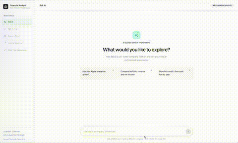
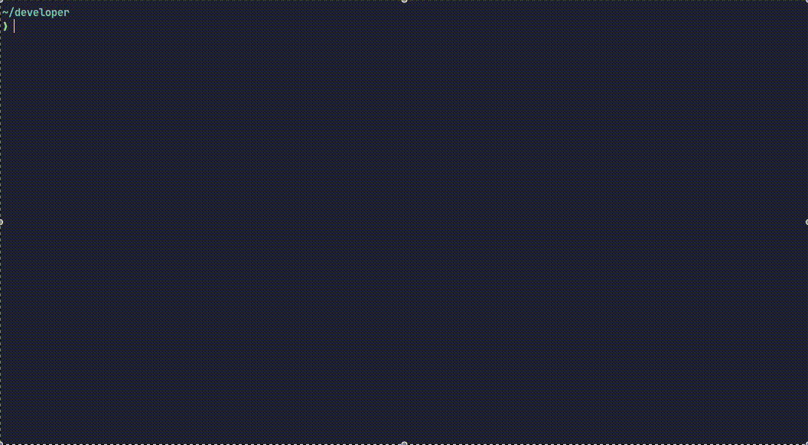
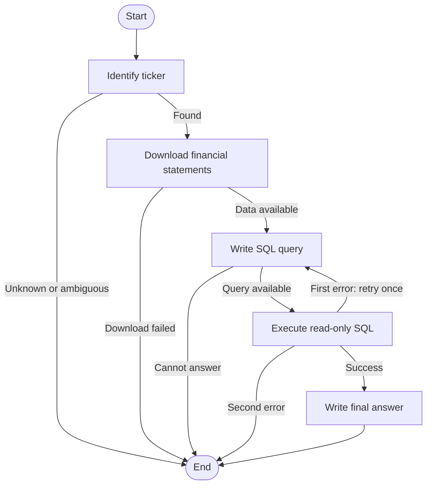

# Financial Analyst

**Ask in plain English. Get financial insights straight in your terminal.**

Financial Analyst turns questions about US-listed stocks into answers backed by
financial statement data. It identifies the company, downloads its annual
statements, writes and runs read-only SQL, and presents the results in a clean
table with a concise explanation. No manual imports. No SQL required.



*CLI command* is also available to type questions directly in the terminal



- **Three statements, one question.** Analyse income statements, balance sheets,
  and cash flows together.
- **From words to numbers.** Ask about growth, margins, cash generation, and more.
- **See the workings.** Add `--query` to inspect the formatted, syntax-highlighted SQL.
- **Automatic SQL correction.** If execution fails, the analyst gets one attempt
  to rewrite the query using the error.
- **Made for the terminal.** Readable tables, progress updates, and a short answer
  keep the analysis easy to follow.

```sh
fin "How has NVIDIA's net margin changed in the last 5 years?"
fin "Compare META's operating cash flows and Capital spending (CAPEX) over the last years" --query
```

## LangGraph workflow



## Tech stack and setup

Built with **Python 3.11+**, **Typer** and **Rich** for the CLI, **LangGraph** for
the workflow, **OpenAI** and **Pydantic** for structured model outputs,
**yfinance** for financial statements, and **SQLite** for local querying.

From the repository root, install the CLI with uv:

```sh
uv tool install .
export OPENAI_API_KEY="your-api-key"
```

The `fin` command is then available from any directory. If your shell cannot find
it, run `uv tool update-shell` and restart your terminal.

```sh
fin ask "What is Amazon's free cash flow for each available year?"
fin ask "Show Apple's operating margin trend in the last 5 years" --query
fin --help
```

Pass the question as one quoted argument. SQL is hidden unless you add `--query`.
The `ask` command is optional: `fin "question"` and `fin ask "question"` run the
same function. The `web` command and `fin --help` remain available.
`financial-analyst` is also available as an alias for `fin`.

The default model is `gpt-5.4-mini`. To choose another compatible model:

```sh
export OPENAI_MODEL="your-model-name"
```

For local development from the repository root, without installing the command globally:

```sh
uv sync
uv run fin ask "Show META's annual operating margins"
```

Statements are stored in `financial-data.sqlite` in your platform's application
data directory. Each successful download replaces the previous stock's data in
three tables: `income_stmt`, `balance_sheet`, and `cashflow`. Rows represent years;
columns represent financial metrics. Available history and metrics depend on the
data returned by Yahoo Finance.

## Web API

Start the local server with `uv run fin web`; it automatically opens
<http://127.0.0.1:8567> in your default browser after a one-second delay.

`POST /ask` runs the LangGraph workflow and returns the complete final state
as JSON, including chart metadata when a chart is selected:

```sh
curl http://127.0.0.1:8567/ask \
  -H 'Content-Type: application/json' \
  -d '{"question":"Show Apple revenue by year","allowed_result_types":["table","linechart","barchart"]}'
```

## Project structure

```text
financial-analyst/
├── frontend/             # React source and Vite build configuration
├── docs/
│   └── demo.gif          # Terminal demo (add your recording here)
├── src/
│   └── analyst/
│       ├── __init__.py
│       ├── cli.py        # Commands, terminal tables, and optional SQL display
│       ├── web.py        # Question API and static frontend serving
│       ├── static/       # Built React frontend, served by the API
│       ├── graph.py      # Ticker identification, SQL generation, execution, and answers
│       └── data.py       # Annual statement downloads and SQLite storage
├── pyproject.toml        # Package metadata, dependencies, and CLI entry points
├── uv.lock              # Locked dependencies
└── README.md
```
